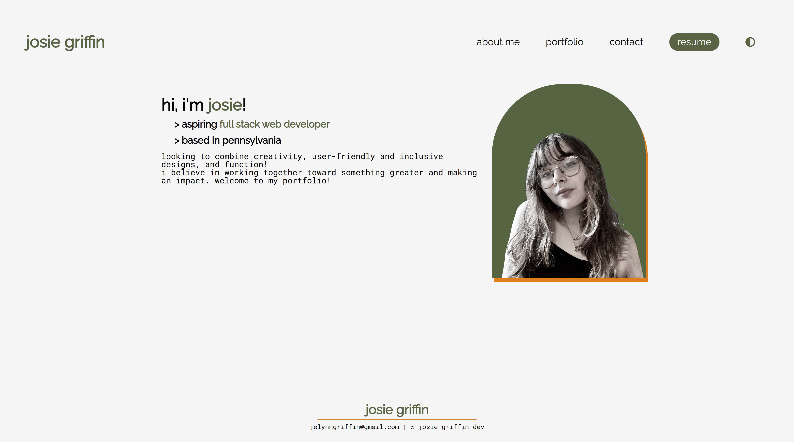

# React Portfolio

## Description
This is a portfolio of my current work, built with React.js from components! I tried to keep it accessible, easy to read, and with a format that anyone could understand and navigate. I plan to build on it as I go and make improvements, as well as implement a dark and light theme (as seen with the selector icon in the navigation that does not currently function!).

## Languages and Technologies
CSS, React.js, JavaScript, JSX
## Table of Contents
- [Installation](#installation)
- [Usage](#usage)
- [Deployed Application](#link-to-deployed-page)
- [Questions](#questions)
- [Contact Info](#contact-me)
    

## Installation
To run this locally, follow these instructions! Otherwise simply follow the deployment link.
- Clone git repository
- Right click repository folder and select `Open in Integrated Terminal`
- To complete installation, run the command `npm run install`.
- From there, run `npm run build` to compile the application in React.

## Usage
Follow the deployment link or run `npm run start` in your terminal after following installation instructions, then explore at your own pace! I hope you enjoy my portfolio :) 

## Screenshots

## Link to Deployed Page

[Live Page](https://josielynngriffin.github.io/josie-react-portfolio/)

---
## Contact Me!
[Github](https://github.com/josielynngriffin) | jelynngriffin@gmail.com | [LinkedIn](https://www.linkedin.com/in/jessica-griffin-a24630277/)